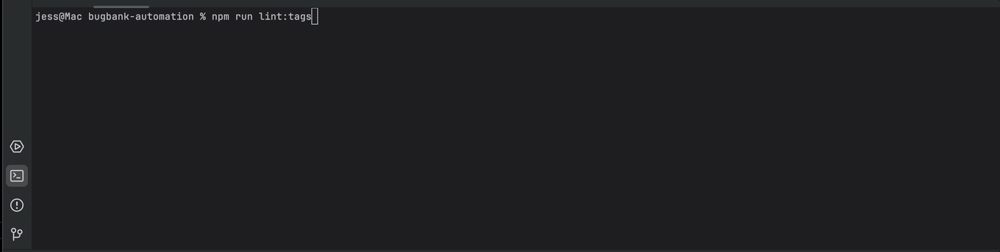

# tag-linter-playwright
[](https://www.npmjs.com/package/tag-linter-playwright)
[](https://www.npmjs.com/package/tag-linter-playwright)
[](https://playwright.dev/)
[](https://www.typescriptlang.org/)
[](https://nodejs.org/)
[](LICENSE)

> ⚠️ **Note:** This README is in English.  
> For the Portuguese version, please see [README.pt-br.md](./README.pt-br.md) or visit the [Portuguese documentation on GitHub](https://github.com/JessicaSilva0/tag-linter-playwright/blob/develop/README.pt-br.md).

> **A lightweight yet powerful tag validator for Playwright tests**  
> Inspired by ESLint, using `@typescript-eslint/parser` to analyze TypeScript or JavaScript code.

---

## 📦 Installation

**Local dependency** (recommended):
```bash
npm install --save-dev tag-linter-playwright
```

**Global installation**:
```bash
npm install -g tag-linter-playwright
```

---

## 🚀 Usage

### Via `package.json` Script

Add the script to your `package.json`:
```json
"scripts": {
  "lint:tags": "playwright-tag-linter"
}
```

Run:
```bash
npm run lint:tags
```

By default, the linter searches for test files matching:
```
**/*.{spec,test}.{ts,js}
```

You can customize the search pattern:
```bash
npm run lint:tags --pattern "tests/**/*.spec.ts"
```

---

### Via CLI

Run directly from the terminal without adding to `package.json`:
```bash
npx playwright-tag-linter --pattern "tests/**/*.spec.ts"
```

---

## `.tagslintrc.json` (opcional)

Create a `.tagslintrc.json` file at the root of your project to define tag validation rules.

**Example:**
```json
{
  "testPattern": "**/*.{spec,test}.{ts,js}",
  "exclude": ["node_modules/**", "dist/**", "coverage/**", ".git/**"],
  "requiredTags": ["@smoke", "@regression"],
  "tagPattern": "^@[a-zA-Z0-9-_]+$",
  "rules": {
    "require-tags": "error",
    "valid-tag-format": "warn",
    "required-tags-present": "warn"
  },
  "tagCategories": {
    "priority": ["@critical", "@high", "@medium", "@low", "@lowest"],
    "type": ["@smoke", "@regression", "@functional", "@api", "@visual"],
    "environment": ["@dev", "@staging", "@uat"]
  }
}
```

---

## CLI Options

| Option            | Description                                   | Example |
|-------------------|-----------------------------------------------|---------|
| `--pattern`       | Glob pattern for test files                   | `--pattern "tests/**/*.spec.ts"` |
| `--required`      | Required tags (comma-separated)               | `--required "@smoke,@critical"` |
| `--verbose`       | Show detailed output                          | `--verbose` |
| `--config`        | Path to a custom `.tagslintrc.json` file      | `--config ./config/tagslintrc.json` |

---

## Example Output

```bash
$ npx playwright-tag-linter --required "@smoke,@critical" --verbose

✔ tests/login.spec.ts: All required tags are present
⚠ tests/payment.spec.ts: Missing required tag @critical
✖ tests/cart.spec.ts: Invalid tag format "@SmokeTest"
```

---

## 🎥 Demo



---

## 🤝 Contributing

Pull requests are welcome!  
Please open an [issue](https://github.com/JessicaSilva0/tag-linter-playwright/issues) to discuss new features, improvements, or bug fixes.

---

## 📜 License

This project is licensed under the [MIT License](LICENSE).

---

## 🎭 Happy Testing  
Made with 💛 by [Jessica Silva](https://github.com/jessicaSilva0)
